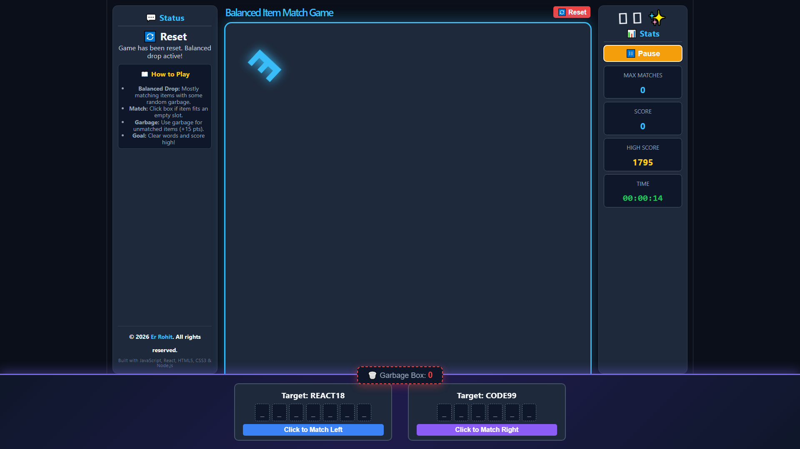

# 🎮 AlphaNum Match: Interactive Word & Number Drop Game

An interactive, arcade-style web game built using **React** and **CSS**, featuring dynamic DVD-logo style bouncing characters, real-time stats tracking, responsive three-column layouts, and smart balancing mechanics.

---

## 🔗 Live Demo & Links
- **Live Game URL:** [https://alphanum-match.vercel.app](https://alphanum-match.vercel.app) 

- **Creator Portfolio:** [Er Rohit Portfolio](https://er-rohit.freedev.app/?i=1) *

---

## 📸 Game Screenshot
  

---

## 🚀 Key Features
- **Smart Item Spawning:** Frequent matching letters/numbers drop down alongside random garbage items.
- **Bouncing Physics Arena:** DVD-logo style smooth bouncing mechanics touching all arena edges with dynamic neon border coloring.
- **Interactive Target Boxes:** Dual word/number completion tracking with independent word rotation.
- **Garbage Management:** Send unmatched items to the garbage bin for bonus points.
- **Pause & Continue:** Dedicated timer control and pause overlay for uninterrupted gaming sessions.

---

## 🛠️ Built With
- **Frontend:** React 18, JSX
- **Styling:** Custom CSS3 with Neon Animations & Gradients
- **Environment:** Node.js, Vite / VS Code

---

## 👨‍💻 Author & Creator
Designed and Developed with ❤️ by **[Er Rohit](https://er-rohit.freedev.app/?i=1)**.

---
*(© 2026 Er Rohit. All rights reserved.)*